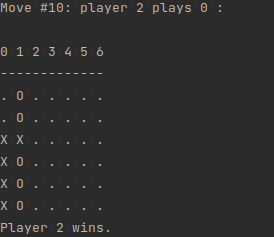

### Отчет
*Низамов Салават Ленарович, 11-805*

### Задача
Рабочий код ИИ для поведения агента в зависимости от входных данных

### Теория
Для решения поставленной задачи я ознакомился с основной терминологией предметной области.

В искусственном интеллекте под термином интеллектуальный агент понимаются сущности, 
получающие информацию через систему сенсоров о состоянии управляемых ими процессов и,
осуществляющие влияние на них через систему актуаторов, при этом их реакция рациональна в том смысле, 
что процессы выполняемые ими содействуют достижению определенных параметров.

#### Виды агентов
- **Агенты с простым поведением** 

  Агенты с простым поведением действуют только на основе текущих знаний. Их агентская функция основана на схеме условие-действие

- **Агенты с поведением, основанным на модели**

  Агенты с поведением, основанным на модели могут оперировать со средой, 
  лишь частично поддающейся наблюдению.

- **Целенаправленные агенты** 

  Целенаправленные агенты схожи с предыдущим типом, однако они, помимо прочего, 
  хранят информацию о тех ситуациях, которые для них желательны. 
  Это дает агенту способ выбрать среди многих путей тот, что приведет к нужной цели.

- **Практичные агенты**

  Целенаправленные агенты различают только состояния, когда цель достигнута, 
  и когда не достигнута. Практичные агенты, помимо этого, способны различать,
  насколько желанно для них текущее состояние. Такая оценка может быть получена 
  с помощью «функции полезности», которая проецирует множество состояний на множество 
  мер полезности состояний.

- **Обучающиеся агенты**

  В некоторой литературе обучающиеся агенты также называются автономными интеллектуальными 
  агентами, что означает их независимость и способность к обучению и приспосабливанию 
  к изменяющимся обстоятельствам.

#### Алгоритм
Поиск Negamax - это вариантная форма поиска Minimax , основанная на нулевой сумме свойство игры для двух игроков.

Этот алгоритм основан на том факте, что max (a, b) = - min (- a, - b) для упрощения реализации алгоритма минимакс . Точнее, значение позиции для игрока A в такой игре является отрицанием значения для игрока B. Таким образом, игрок на ходу ищет ход, который максимизирует отрицание значения, полученного в результате этого хода: эта последующая позиция должны по определению быть оценены противником.

### Решение
Для учебных целей я выбрал простого агента, выступающего в роли соперника в игре “4 в ряд”. 

#### input
В роли сенсора в данном случае выступает терминал. 
В роли входных данных - номер клетки, в которую игрок хочет поместить свою фишку. 

#### algorithm
Получая на вход информацию с рецептора, при помощи алгоритма Negamax, 
основанный на дереве игры вычисляется наиболее оптимальный ход, 
в зависимости от расположения фишек на доске (Используется реализация алгоритма 
из python-библиотеки easyAI)
параметр depth = 5 (кол-во рассчитываемых наперед шагов)

#### output
На выходе от агента мы получаем оптимальный ход, просчитанный при помощи вышеупомянутого алгоритма

### Links
https://livepcwiki.ru/wiki/Negamax

https://github.com/Zulko/easyAI

https://en.wikipedia.org/wiki/Intelligent_agent